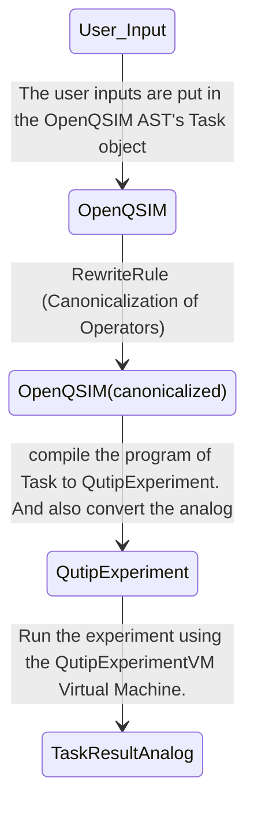

## Compilation

We first compile `AnalogCircuit` to a [`QutipExperiment`][oqd_analog_emulator.conversion.QutipExperimentVM] 
using the ConversionRule [`QutipBackendCompiler`][oqd_analog_emulator.conversion.QutipBackendCompiler].
We also then separately convert the args of Analog layer to a corresponding representation of the args
which can be processed by QuTip. The [`compile`][oqd_analog_emulator.qutip_backend.QutipBackend.compile] functions
is used to compile `AnalogCircuit` to a 
[`QutipExperiment`][oqd_analog_emulator.conversion.QutipExperimentVM] and also used to convert the args.

## Simulation

After compilation, the time dynamical evolution is emulated using the Qutip implementation of the Schrödinger equation,
[`qutip.sesolve`](https://qutip.readthedocs.io/en/stable/apidoc/functions.html#module-qutip.solver.sesolve).

